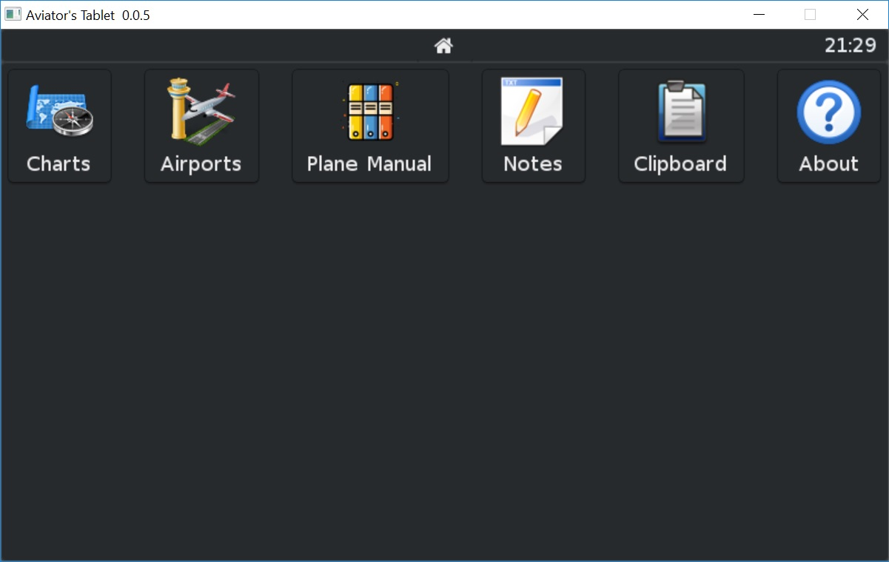

# AviTab - The Aviator's Tablet

AviTab is a plugin for the [X-Plane](http://www.x-plane.com/) flight simulator.
It displays a tablet like computer with a few apps in the cockpit. It is mainly
used for flying in virtual reality.

More screenshots here: [Screenshots](screenshots/)

## Purpose
When flying in a simulator, one often needs to lookup details in PDF charts, plane manuals,
checklists or other documents. Using a PDF reader breaks the immersion because the virtual aviator
either has to take off of their HMD or use other tools that can move windows into VR.

AviTab tries to solve this problem by offering a PDF reader inside a native plugin for X-Plane.
Using a plugin also opens possibilites for more apps inside the tablet, for example to display information
about the plane status or aid in navigation.

## Installation

* Download the latest release from the [release page](https://github.com/fpw/avitab/releases/latest)
* Extract the archive and move the folder into your X-Plane/Resources/Plugins directory
* Start X-Plane
* Find a new menu inside the plugins directory to toggle the tablet
* Optionally, you can assign a key for this command (I prefer the right-hand lower trigger)

## Usage

### General
When hovering over the edges of the tablet from a short distance, X-Plane will display green bars around the tablet.
The _upper_ bar can be used to grab the window and move it around inside the cockpit. The other bars can be used to
resize the tablet - however, resizing is _not supported_ so please do not try it.

### Charts Viewer
The charts viewer displays PDF files inside the charts/ subdirectory of the plugin directoy. You can add your
charts there, including subdirectories.

### Clipboard
This app displays the textual contents of your clipboard, if any. This can be used to transfer flight plans from
a website into VR via your clipboard.

### Clock
The upper right of the tablet features a clock that displays your computer's time in case you are simulating
a different time and still want to keep track of the real life outside.

## Limitations

* There is a bug in the current beta version of X-Plane (b3) where dragging does not work with the VR controllers.
  Using panning gestures is therefore not possible right now. When using AviTab outside VR, this works.
* Resizing the tablet is not supported.
* PDFs containing [CJK fonts](https://en.wikipedia.org/wiki/List_of_CJK_fonts)
  or ancient fonts such [Linear B](https://en.wikipedia.org/wiki/Linear_B) are not supported.
  This is mainly due to font sizes - a version containing all fonts would be 40 Megabytes in size.

## Donate
If you like AviTab and want to support its further development, you can donate.

